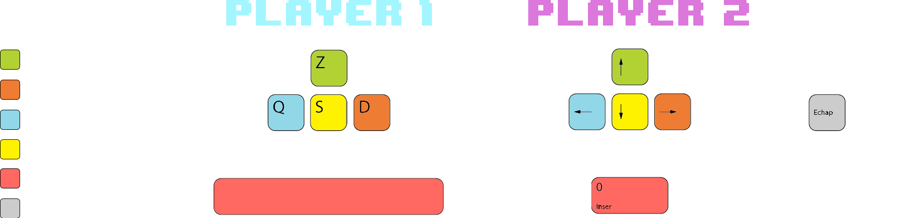
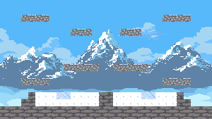

# 


16-bit 1v1 platform minigame made for a final high-school project

- Runs on Python 3.7 (or more recent) using the Pygame library.

## How to play
**Both players spawn in a closed arena where they have shoot at each other until one of them loose all its 3 hp.**

- Controls are displayed in "Contrôles" on the main menu


- There are 3 maps you can play on : Sunset Mountain, Icy Arena and Neo Lagos

  

## How to launch

**Executable**
1. Execute "DashLegends.exe"

**Install pygame on Windows**

1. Install pygame with pip on the command prompt
```
py -m pip install -U pygame --user
```
2. Launch main.py from the game repository
```
py main.py
```

**Install pygame on Linux or MacOS**

1. Install pygame with pip
```
python3 -m pip install -U pygame --user
```
2. Launch main.py from the game repository
```
python3 main.py
```
